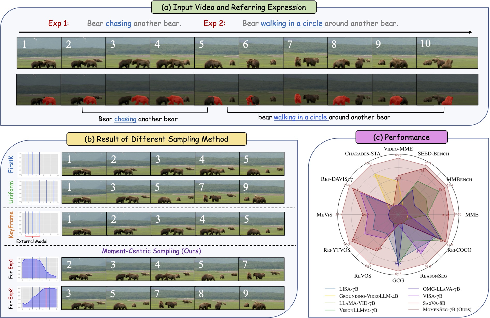
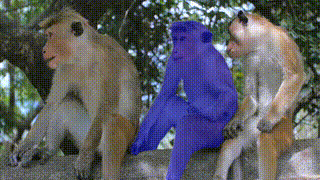
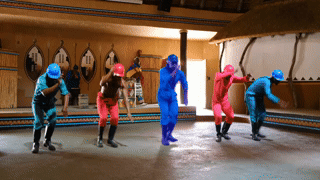

<h2 align="center">MomentSeg: Moment-Centric Sampling for Enhanced <br> Video Pixel Understanding</h2>

<p align="center">
  <a href="" target="_blank"></a>
  <a href="h" target="_blank"></a>
  <a href="" target="_blank"></a>
</p>

<p align="center">
  <a href="https://dmmm1997.github.io/">Ming Dai</a><sup>1</sup>, <a href="https://senyang-ml.github.io/research/index_en.html">Sen Yang</a><sup>2</sup>, <a href="">Boqiang Duan</a><sup>2</sup>, <a href="https://automation.seu.edu.cn/ywk/list.htm">Wankou Yang</a><sup>1</sup>, <a href="https://jingdongwang2017.github.io/">Jingdong Wang</a><sup>2</sup>
  <p align="center"><sup>1</sup>Southeast University; <sup>2</sup>Baidu VIS<br/></p>
</p>

---

<video src="assets/videos/demo.mp4" controls width="600" autoplay loop muted playsinline>
</video>

---

**MomentSeg** is a unified MLLM for pixel-level vision–language understanding, designed with a moment-centric sampling strategy to better capture fine-grained semantics in video. It flexibly supports a range of tasks, including referring and reasoning image/video segmentation, video temporal grounding, and image/video question answering.

<p align="center"></p>

## 🔥 News

- **`2025.10.12`** 🔥 Our paper and video demo has been released.

## 🕒 Open-Source Plan

* [X] **Paper and Video Demo**
* [ ] **Model Weights and Inference Instructions** — Coming soon
* [ ] **Training Code and Detailed Documentation** — To be released in a later phase

---

## 🎥 Demo

<details open>
<summary>Demo 1</summary>
Input Video (Source: Internet):



Instruction: "Please segment the monkey that is scratching its ear."

</details>

<details open>
<summary>Demo 2</summary>
Input Video (Source: Internet):



Instruction: "Please segment the person standing in the center wearing blue clothes."

</details>

## 🏆 Performance

<details open>
<summary style="font-size: 1.0em; font-weight: bold;"> 🖼️ Image-level Segmentation</summary>

> *(Referring Image Segmentation & Reasoning Segmentation)*

| Benchmark                | Evaluation Results (3B/7B)                                     |
| ------------------------ | -------------------------------------------------------------- |
| **RefCOCO (RES)**  | `val: 82.1/82.6` `testA: 83.7/85.1` `testB: 79.2/80.2` |
| **RefCOCO+ (RES)** | `val: 76.9/78.2` `testA: 81.1/81.9` `testB: 71.8/71.3` |
| **RefCOCOg (RES)** | `val(U): 78.8/80.1` `test(U): 79.2/80.1`                  |
| **ReasonSeg**      | `val: 62.0/63.3` `test: 64.3/65.5`                        |

</details>

<details open>
<summary style="font-size: 1.0em; font-weight: bold;"> 🎬 Video-level Segmentation</summary>

> *(Referring Video Object Segmentation)*

| Benchmark                       | Evaluation Results (3B/7B)                             |
| ------------------------------- | ------------------------------------------------------ |
| **ReVOS (val)**           | `J: 59.7/61.9` `F: 64.4/66.1` `J&F: 62.1/64.0` |
| **MeViS (val_u)**         | `J: 58.1/58.7` `F: 65.9/66.5` `J&F: 62.0/62.6` |
| **MeViS (val)**           | `J: 51.7/53.9` `F: 58.0/60.2` `J&F: 54.8/57.1` |
| **Ref-YouTube-VOS (val)** | `J: 69.8/70.1` `F: 74.3/74.5` `J&F: 72.0/72.3` |
| **Ref-DAVIS17 (val)**     | `J: 72.2/73.2` `F: 80.6/81.7` `J&F: 76.4/77.4` |
| **Ref-SAV (val)**         | `J: 79.2/80.1` `F: 80.6/81.4` `J&F: 79.9/80.8` |

</details>

<details open>
<summary style="font-size: 1.0em; font-weight: bold;"> ⏱️ Temporal Sentence Grounding</summary>

> *(Temporal Sentence Grounding)*

| Benchmark                       | Evaluation Results (3B)                          |
| ------------------------------- | ------------------------------------------------ |
| **Charades-STA**          | `R@0.3: 76.1` `R@0.5: 58.2` `mIoU: 50.0` |
| **ActivityNet-Grounding** | `R@0.3: 65.6` `R@0.5: 45.6` `mIoU: 45.1` |

</details>

## 🤖 Model Zoo (TODO)

| Model Name |                            Base MLLM                            |  HF Link  |
| :--------: | :--------------------------------------------------------------: | :-------: |
|  Sa2VA-3B  | [Qwen2.5-VL-3B](https://huggingface.co/Qwen/Qwen2.5-VL-3B-Instruct) | [🤗 link] |
|  Sa2VA-7B  | [Qwen2.5-VL-7B](https://huggingface.co/Qwen/Qwen2.5-VL-7B-Instruct) | [🤗 link] |

## 🚀 Training (TODO)

## 📊 Evaluation (TODO)

## 📖 Citation

Please kindly cite our paper if you find this project helpful.

```bibtex

```
