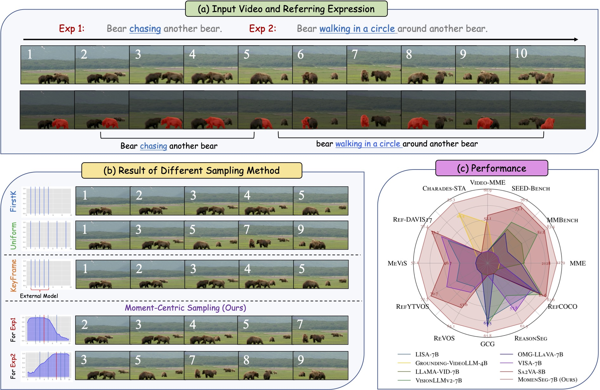
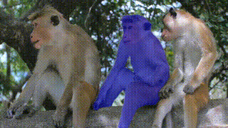
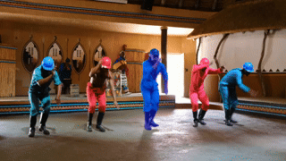

<h2 align="center">MomentSeg: Moment-Centric Sampling for Enhanced <br> Video Pixel Understanding</h2>

<p align="center">
  <a href="https://arxiv.org/abs/2510.09274" target="_blank"></a>
  <a href="https://dmmm1997.github.io/momentseg/" target="_blank"></a>
  <a href="https://modelscope.cn/models/dmmm997/MomentSeg-3B" target="_blank"></a>
  <a href="https://modelscope.cn/datasets/dmmm997/MomentSeg/files" target="_blank"></a>
</p>

<p align="center">
  <a href="https://dmmm1997.github.io/">Ming Dai</a><sup>1</sup>, <a href="https://scholar.google.com/citations?hl=zh-CN&user=z5O3DLcAAAAJ">Sen Yang</a><sup>2</sup>, Boqiang Duan<sup>2</sup>, <a href="https://automation.seu.edu.cn/ywk/list.htm">Wankou Yang</a><sup>1</sup>, <a href="https://jingdongwang2017.github.io/">Jingdong Wang</a><sup>2</sup>
</p>
<p align="center"><sup>1</sup>Southeast University; <sup>2</sup>Baidu VIS</p>

---


---

**MomentSeg** is a unified MLLM for pixel-level vision–language understanding, designed with a moment-centric sampling strategy to better capture fine-grained semantics in video. It flexibly supports a range of tasks, including referring and reasoning segmentation for images and videos, temporal sentence grounding, and image/video question answering.

<p align="center"></p>

## 🔥 News

- **`2026.06.19`** 🔥 We release the [training code](train.sh), [inference code](demo/demo.py), [evaluation code](test.sh), [data package](https://modelscope.cn/datasets/dmmm997/MomentSeg/files), and checkpoints for [MomentSeg-3B](https://modelscope.cn/models/dmmm997/MomentSeg-3B) and [MomentSeg-7B](https://modelscope.cn/models/dmmm997/MomentSeg-7B).
- **`2026.06.18`** 🎉 MomentSeg was accepted to **ECCV 2026**.
- **`2025.10.12`** 🔥 We released the paper and video demo.

## 🕒 Release Status

* [X] **Paper and Video Demo**
* [X] **Model Checkpoints and Inference Instructions**
* [X] **Training Code and Detailed Documentation**
* [X] **Data Release**

---

## 🎥 Demo

<details open>
<summary>Demo 1</summary>
Input video (source: Internet):



Prompt: "Please segment the monkey that is scratching its ear."

</details>

<details open>
<summary>Demo 2</summary>
Input video (source: Internet):



Prompt: "Please segment the person standing in the center wearing blue clothes."

</details>

## 🏆 Performance

<details open>
<summary style="font-size: 1.0em; font-weight: bold;"> 🖼️ Image-level Segmentation</summary>

> *(Referring Image Segmentation & Reasoning Segmentation)*

| Benchmark                | Evaluation Results (3B/7B)                                     |
| ------------------------ | -------------------------------------------------------------- |
| **RefCOCO (RES)**  | `val: 82.1/82.6` `testA: 83.7/85.1` `testB: 79.2/80.2` |
| **RefCOCO+ (RES)** | `val: 76.9/78.2` `testA: 81.1/81.9` `testB: 71.8/72.3` |
| **RefCOCOg (RES)** | `val(U): 78.8/80.1` `test(U): 79.2/80.1`                  |
| **ReasonSeg**      | `val: 62.0/63.3` `test: 64.3/65.5`                        |
| **GCG**            | `val: 67.0/67.8` `test: 65.9/67.9`                        |

</details>

<details open>
<summary style="font-size: 1.0em; font-weight: bold;"> 🎬 Video-level Segmentation</summary>

> *(Referring and Reasoning Video Object Segmentation)*

| Benchmark                       | Evaluation Results (3B/7B)                             |
| ------------------------------- | ------------------------------------------------------ |
| **ReVOS (overall)** | `J: 60.0/62.3` `F: 65.2/67.8` `J&F: 62.6/65.1` |
| **ReasonVOS**       | `J: 58.2/59.2` `F: 65.3/66.1` `J&F: 61.7/62.7` |
| **MeViS (val_u)**         | `J: 58.1/58.7` `F: 65.9/66.5` `J&F: 62.0/62.6` |
| **MeViS (val)**           | `J: 51.7/53.9` `F: 58.0/60.2` `J&F: 54.8/57.1` |
| **Ref-YouTube-VOS** | `J: 69.8/70.1` `F: 74.3/74.5` `J&F: 72.0/72.3` |
| **Ref-DAVIS17**     | `J: 72.2/73.2` `F: 80.6/81.7` `J&F: 76.4/77.4` |
| **Ref-SAV**         | `J: 62.9/--` `F: 65.2/--` `J&F: 64.0/--` |

</details>

<details open>
<summary style="font-size: 1.0em; font-weight: bold;"> ⏱️ Temporal Sentence Grounding</summary>

> *(Temporal Sentence Grounding)*

| Benchmark                       | Evaluation Results (3B)                          |
| ------------------------------- | ------------------------------------------------ |
| **Charades-STA**          | `R@0.3: 76.1` `R@0.5: 58.2` `R@0.7: 25.8` `mIoU: 50.2` |
| **ActivityNet-Grounding** | `R@0.3: 67.5` `R@0.5: 44.7` `R@0.7: 23.2` `mIoU: 45.4` |

</details>

## 🤖 Model Zoo

| Model Name | Base MLLM | Mask Decoder | Checkpoint |
| :---: | :---: | :---: | :---: |
| MomentSeg-3B | [Qwen2.5-VL-3B-Instruct](https://huggingface.co/Qwen/Qwen2.5-VL-3B-Instruct) | [SAM2-Hiera-Large](https://dl.fbaipublicfiles.com/segment_anything_2/072824/sam2_hiera_large.pt) | [Checkpoint](https://modelscope.cn/models/dmmm997/MomentSeg-3B) |
| MomentSeg-7B | [Qwen2.5-VL-7B-Instruct](https://huggingface.co/Qwen/Qwen2.5-VL-7B-Instruct) | [SAM2-Hiera-Large](https://dl.fbaipublicfiles.com/segment_anything_2/072824/sam2_hiera_large.pt) | [Checkpoint](https://modelscope.cn/models/dmmm997/MomentSeg-7B) |

## 🛠️ Installation

Create the environment and install the project dependencies:

```bash
conda create -n momentseg python=3.10 -y
conda activate momentseg

# Install the PyTorch build that matches your CUDA version first.
pip install -r requirements.txt
```

Prepare the base MLLM and mask decoder checkpoints under `pretrained/`:

```text
pretrained/
├── Qwen2.5-VL-3B-Instruct/
├── Qwen2.5-VL-7B-Instruct/
└── sam2_hiera_large.pt
```

For example:

```bash
huggingface-cli download Qwen/Qwen2.5-VL-3B-Instruct \
  --local-dir pretrained/Qwen2.5-VL-3B-Instruct

huggingface-cli download Qwen/Qwen2.5-VL-7B-Instruct \
  --local-dir pretrained/Qwen2.5-VL-7B-Instruct

curl -L \
  https://dl.fbaipublicfiles.com/segment_anything_2/072824/sam2_hiera_large.pt \
  -o pretrained/sam2_hiera_large.pt
```

## 📚 Data Preparation

The released data package is available at [MomentSeg Data](https://modelscope.cn/datasets/dmmm997/MomentSeg/files).
If you prepare the data manually, organize the original datasets and processed
annotations under `data/` as follows:

```text
data/
├── video_datas/
│   ├── revos/
│   ├── mevis/
│   │   └── train/
│   ├── rvos/
│   ├── ref_sav_eval/
│   │   ├── videos/
│   │   ├── meta_expressions_valid.json
│   │   └── mask_dict.json
│   ├── chat_univi/
│   │   ├── Activity_Videos/
│   │   └── video_chat.json
│   ├── sam_v_full/
│   └── sam_v_final_custom.json
├── ref_seg/
│   ├── refcoco/
│   ├── refcoco+/
│   └── refcocog/
├── reason_seg/
├── glamm_data/
│   ├── images/
│   └── annotations/
├── llava_data/
│   ├── llava_images/
│   ├── LLaVA-Instruct-150K/
│   └── LLaVA-Pretrain/
└── VTG/
    └── NumPro_FT/
        ├── videos_1FPS/
        ├── train.caption_coco_format.json
        └── activitynet_captions_train.json
```

The main training configs read paths relative to `./data/`. Please keep the
folder names consistent with the layout above, or update the corresponding
paths in:

```text
projects/qwenvl_sam2/configs/momentseg-3B.py
projects/qwenvl_sam2/configs/momentseg-7B.py
```

## 🚀 Training

MomentSeg provides training configs for both model scales:

```text
projects/qwenvl_sam2/configs/momentseg-3B.py
projects/qwenvl_sam2/configs/momentseg-7B.py
```

Use the root training launcher:

```bash
bash train.sh
```

`train.sh` reads configs from `CONFIG_LIST` and uses `NUM_GPUS` and `PORT` for
distributed launch. Edit `CONFIG_LIST` to select the model scale, or override
the launch settings from the command line:

```bash
NUM_GPUS=8 PORT=29500 bash train.sh
```

You can also launch a config manually:

```bash
bash tools/dist.sh train projects/qwenvl_sam2/configs/momentseg-3B.py 8
```

After training, convert the checkpoint to Hugging Face format if needed:

```bash
python projects/qwenvl_sam2/hf/convert_to_hf_qwenv2.py \
  projects/qwenvl_sam2/configs/momentseg-3B.py \
  --pth-model work_dirs/momentseg-3B/iter_xxx.pth \
  --save-path work_dirs/momentseg-3B/hf_model
```

## 🎬 Demo Usage

Run inference on an image, a video, or a folder of frames with `demo/demo.py`.
The demo uses `checkpoints/MomentSeg-3B` by default and saves visualized results
to `output/demo` unless `--work-dir` is specified:

```bash
CUDA_VISIBLE_DEVICES=0 python demo/demo.py \
  <IMAGE_OR_VIDEO_OR_FRAME_FOLDER> \
  --model_path <MODEL_DIR> \
  --work-dir output/demo \
  --text "xxx"
```

`<MODEL_DIR>` can be a released MomentSeg checkpoint directory or a locally converted
Hugging Face model directory, such as:

```text
checkpoints/MomentSeg-3B
checkpoints/MomentSeg-7B
```

## 📊 Evaluation

For full evaluation, update `MODEL_PATHS`, `NUM_GPUS`, and `MASTER_PORT` in
the provided script, then run:

```bash
bash test.sh
```

The main video segmentation evaluation entry point is:

```bash
torchrun --nproc_per_node=4 --master_port=29506 \
  projects/qwenvl_sam2/evaluation/ref_vos_eval.py \
  <MODEL_DIR> \
  --dataset REVOS \
  --launcher pytorch \
  --work_dir <OUTPUT_DIR> \
  --frame_num 8 \
  --inference_mode multi-frame \
  --video_max_frames 100
```

Metric scripts are provided under `tools/eval/`, including:

```text
tools/eval/eval_revos.py
tools/eval/eval_mevis.py
tools/eval/eval_davis.py
tools/eval/eval_ref_sav.py
tools/eval/eval_reasonvos.py
tools/eval/eval_tvg.py
```

For example:

```bash
python tools/eval/eval_revos.py <OUTPUT_DIR>/REVOS.json \
  --save_json_name revos_valid.json
```

## 🙏 Acknowledgements

This project builds on the foundation of [Sa2VA](https://github.com/magic-research/Sa2VA). We sincerely thank the Sa2VA team for releasing their codebase and model framework.

## 📖 Citation

Please cite our paper if you find this project helpful.

```bibtex
@misc{momentseg,
      title={MomentSeg: Moment-Centric Sampling for Enhanced Video Pixel Understanding}, 
      author={Ming Dai and Sen Yang and Boqiang Duan and Wankou Yang and Jingdong Wang},
      year={2025},
      eprint={2510.09274},
      archivePrefix={arXiv},
      primaryClass={cs.CV},
      url={https://arxiv.org/abs/2510.09274}, 
}
```
